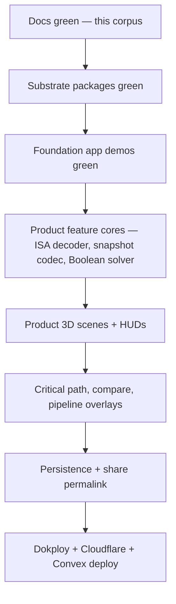

# AGENT-DOCTRINE

Project-specific agent behavior. Cross-project rules live in `book/PHILOSOPHY.md`, `book/HARD-RULES.md`, `book/SUBSTRATE.md`. This file carries this project's specializations.

## Single-pass build posture

Per `book/PHILOSOPHY.md` "Single-pass build", every locked feature in `REQUIREMENTS.md` grinds in topological order driven by data dependency:

No phased "ship MVP, polish later" carve-outs. Floor never ceiling.

## Reference repo discipline

The reference at `~/mips/ref` is the source of truth for the locked single-cycle MIPS datapath topology, control signals, paths, segments, value-ids, step semantics, and encoding rules. The agent reads ref but never references it by absolute path in any tracked doc or commit. Domain semantics flow ref → `MIPS-DATAPATH.md` + `MIPS-ISA.md` + code, never via cross-repo import. Per `book/HARD-RULES.md` "No code import across repos".

The ref's 2D SVG presentation is NOT the source of truth for our 3D rendering. Topology is the contract; aesthetic is greenfield.

## No school references

Banned in code, docs, commits, copy, OG cards, metadata, package names, comments: CS2100, Orbital, NUS, Apollo 11, "course", "exam", "lecture", "student", "homework", "assignment", "syllabus", "grade", institution names. Allowed: "learner", "developer", "self-paced", "interactive", domain vocabulary (instruction, control signal, prime implicant, minterm, etc.).

Caught by: doc-lint regex scans for the banned vocab; substrate source greps for the same.

## Atemporal docs

Every doc reads as the initial idea. Banned phrasings: "we switched from", "previously", "originally", "migrate later", "for now", "in v2", "next iteration", "the old approach", "currently we", "in the future we". Locked-pick + why + caught-by stays; rejected options trim once locked, preserved in git history.

Per `book/PHILOSOPHY.md` "Unlimited rework pre-launch" — rework is free, but the rewrite reads as the initial draft.

Caught by: doc-lint regex scan + reviewer pass.

## Substrate-first contribution direction

Every change PR-shaped for review (or commit-shaped for solo) is classified as substrate or product before code lands. Substrate changes carry the "is this generic enough to ship to strangers" test. Product changes carry the "is substrate already offering this" test. Mixed-mode commits (substrate + product in one) are split per-package.

Caught by: commit path lint — staged paths must match one of `packages/*` (substrate) or `apps/web/**` (product) but not both unless ADR-approved.

## Self-host first, no managed-primitive lock-in

Every infrastructure pick has a self-host equivalent that runs in compose locally with the same Helm chart in cluster. Bearer-mode third parties (Cloudflare CDN, Convex Cloud if ever adopted) are accelerants additive on top of self-host, never required for the system to function.

Caught by: `make verify.local` (pure self-host) AND `make verify.bearer` (with bearer accelerants) both green in CI.

## Locked floor, never less

Every item in `REQUIREMENTS.md` ships. Items in `NON-GOALS.md` are deferred with explicit trigger. No third state. Items not in either doc that surface during build are surfaced as MCQs to land into one of the two.

## Anonymous-first, never login walls

Every sim, every save, every share works without identity. Signin is optional accent in the nav corner, sole purpose cross-device persistence. No modals, no walls, no nags. Per `AUTH.md`.

Caught by: route-handler smoke test asserts every interactive surface returns full functionality with no auth cookie.

## Determinism mandate

Same input → frame-accurate same animation. Per `DETERMINISM.md` — fixed timestep, deterministic state machine, no `Math.random()` outside seeded contexts, no `Date.now()` inside hot loops, no system-dependent ordering. Banned patterns enforced by `tools/lint/no-determinism-leak.ts`.

Caught by: golden-trace tests + codec hash-stability + cross-machine CI hash test.

## Performance mandate

Every locked budget in `PERFORMANCE.md` is a CI gate, not a guideline. 60 fps locked, LCP ≤ 1.5s on cable, INP ≤ 100ms desktop. Bundle-size + Lighthouse-CI + frame-budget + heap-leak gates green per `adr/perf-budget.md`.

## Accessibility mandate

Every UI surface meets `A11Y.md` floor. WCAG AA contrast, full keyboard navigation per route matrix, screen-reader-discoverable 3D entities via DOM proxies, reduced-motion alternate UX. Color-blind palette variants ship. `axe-core` zero violations gated in CI.

## Caveman docs

Per `book/PHILOSOPHY.md` "Agent-first docs". Drop articles, fragments OK, mermaid first, prose ≤2 sentences. Every line carries a decision, constraint, fact, or pointer. Filler/framing deletes on next pass.

This file holds itself to the same bar.
