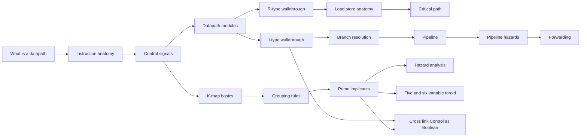

# CONTENT-DESIGN

Pedagogical sequence for learn pages. The actual flow that teaches, the actual progression of concepts, what each page assumes and delivers.

`LEARN.md` carries shape + tooling. This carries the content design.

## Pedagogical framework

Constructivist + concept-anchored. Every page:
- Opens with the diagram (3D / 2D widget visible above the fold)
- Builds intuition before formalism
- Pairs every claim with a manipulable widget
- Avoids "let's explore..." framing — starts with the thing
- Closes with the user trying the concept themselves

Reference: Bartosz Ciechanowski's essays.

## Sequence

## Page outlines

### `intro/what-is-a-datapath`

**Premise**: Reader has heard of "CPU" but doesn't have a clear mental model.

**Opens**: A single 3D datapath scene, idle, fully visible. Annotated callouts to PC, RF, ALU, DM with one-line definitions.

**Argument**: A datapath is the physical road instructions travel. Components are stops along the road. Different instructions take different routes through the same road.

**Interactive**: User clicks `add`, `lw`, `beq` buttons → datapath highlights the route each instruction takes. No animation yet, just static highlight.

**Closes**: "Now you've seen three routes. The next page shows what makes one instruction one instruction — its anatomy."

### `intro/instruction-anatomy`

**Opens**: A 32-bit row, color-coded by field. R-type, I-type, J-type tabs.

**Argument**: An instruction is a 32-bit number with structured fields. The CPU reads it as fields, not as a number.

**Interactive**: User types asm; live encoding view shows the bits and fields. Click any field → field highlights, hover shows bit positions.

**Closes**: "Fields drive what the datapath does next. The next page shows how — through control signals."

### `intro/control-signals`

**Opens**: A side-by-side: opcode field on the left, list of 9 control signals on the right. Lines connecting them.

**Argument**: The Control unit reads the opcode and decides what every mux and memory does this cycle. 9 binary decisions per instruction.

**Interactive**: User selects an instruction → Control unit signals light up with their values; matching components downstream light too.

**Closes**: "These 9 signals ARE the instruction's recipe. The next page shows what each module in the datapath actually does."

### `datapath/r-type-walkthrough`

**Opens**: 3D datapath frozen at `add $t0, $t1, $t2` mid-EX step.

**Argument**: Step-by-step trace through `add`. IF reads instr. ID decodes + reads regs. EX computes. MEM idle. WB writes result.

**Interactive**: User scrubs step-by-step. Per step, narration + 3D scene + diff highlights what changed.

**Closes**: "All R-type instructions follow this same path; the ALU op changes. Next page: I-type."

### `datapath/i-type-walkthrough`

**Opens**: 3D datapath frozen at `addi $t0, $t1, 5` mid-EX step.

**Argument**: I-type adds an immediate operand instead of a second register. ALUSrc mux flips. Sign-extend feeds the second ALU input.

**Interactive**: User scrubs step-by-step. ALUSrc highlighted as the key difference from R-type.

**Closes**: "Next: loads and stores."

### `datapath/load-store-anatomy`

**Opens**: 3D datapath at `lw $t0, 0($t1)` MEM step.

**Argument**: Loads use ALU as address-computer, then read data memory. Stores write data memory. MemRead vs MemWrite vs MemToReg explained.

**Interactive**: Toggle `lw` vs `sw`. Compare signal-by-signal.

**Closes**: "Next: branches."

### `datapath/branch-resolution`

**Opens**: 3D datapath at `beq $t0, $t1, label` EX step.

**Argument**: Branches use ALU as comparator (subtract, check zero). Branch + Zero gate decides PCSrc. The branch target is computed in parallel by Branch Adder.

**Interactive**: Toggle `beq` vs `bne`. Show how BranchNE inverts via NOT gate.

**Closes**: "Critical path next — how fast can this datapath run?"

### `datapath/critical-path`

**Opens**: 3D datapath with `lw` running, critical path highlighted.

**Argument**: Clock period is bounded by worst-case path. `lw` is worst-case under typical delays. Editing delays shifts the bottleneck.

**Interactive**: Delay-table editor on the side; user changes a value, sees critical path shift and worst-case recompute.

**Closes**: "Pipelining can break the critical-path bottleneck. Next page."

### `pipeline/01-stages`

**Opens**: Stage-time diagram with 5 instructions, no hazards.

**Argument**: Split execution into 5 stages, overlap instructions. CPI approaches 1.

**Interactive**: Step cycle-by-cycle. See instructions filling the pipeline.

**Closes**: "Real programs aren't this clean. Next: hazards."

### `pipeline/02-hazards`

**Opens**: Stage-time diagram with a RAW hazard, no forwarding, stall visible.

**Argument**: When instr N+1 needs instr N's result before WB, the pipeline must stall. RAW, WAW, WAR, control hazards.

**Interactive**: User edits the program, sees hazards detected live.

**Closes**: "Forwarding can resolve most RAW hazards. Next page."

### `pipeline/03-forwarding`

**Opens**: Same stage-time diagram, now with forwarding on, arrow drawn from EX/MEM latch to next EX.

**Argument**: Route stage output directly to consumer's input, skip the WB-then-RF-read roundtrip. Load-use is the unresolvable case.

**Interactive**: Toggle forwarding on/off, CPI counter updates.

**Closes**: "That covers single-cycle, hazards, forwarding. Now: K-map."

### `kmap/01-truth-tables`

**Opens**: 4-row 2-var truth table with K-map preview alongside.

**Argument**: Boolean function = truth table = K-map. Three views of the same thing.

**Interactive**: Toggle truth-table cells, K-map updates live, expression too.

**Closes**: "K-map's value: visual grouping. Next page."

### `kmap/02-grouping-rules`

**Opens**: 4-var K-map with three groups highlighted, varying sizes.

**Argument**: Group adjacent 1s in 2^k rectangles. Bigger groups = fewer literals. Wraparound allowed.

**Interactive**: User drags groups; minimal SOP updates live.

**Closes**: "Best minimization needs all prime implicants. Next page."

### `kmap/03-prime-implicants`

**Opens**: 4-var K-map with all PIs auto-highlighted, EPIs thicker outlined.

**Argument**: PI = group that can't be enlarged. EPI = PI that covers a minterm no other PI does. Minimal cover = all EPIs + any extra needed.

**Interactive**: Hide / show solver-recommended cover; compare to user's manual cover.

**Closes**: "5+ variables breaks 2D presentation. Next page is the 3D solution."

### `kmap/04-five-six-var-toroid`

**Opens**: 3D toroidal K-map for a known 5-var function.

**Argument**: 5+ vars wrap in two dimensions. 2D split-maps lose the wraparound. 3D torus shows the genuine adjacency.

**Interactive**: Rotate the torus. Group across the wrap edge. Compare with flat unrolled view.

**Closes**: "Hazards next."

### `kmap/05-hazard-analysis`

**Opens**: K-map with two non-overlapping groups + hazard-prone transition highlighted.

**Argument**: Glitches happen when input transitions between minterms in different groups. Adding a redundant PI covering the transition eliminates the static hazard.

**Interactive**: Toggle the hazard-cover PI on/off, see hazard flag appear/disappear.

**Closes**: "Final page: the headline link — K-map IS the Control unit."

### `cross-link/derive-control-in-kmap`

**The killer demo.** Per `LEARN.md`.

**Opens**: Split screen — left has truth table of opcode → `RegDst`, right has K-map.

**Argument**: The Control unit is 9 Boolean functions of opcode bits. Each can be minimized in K-map. The result is the actual logic of the Control unit.

**Interactive**:
1. K-map shows `RegDst(opcode[5..0])` truth table from the locked subset
2. User groups minterms; minimal SOP appears live
3. Click "show this function in datapath"
4. Datapath scene appears, stepping any instruction lights Control unit's RegDst output
5. The K-map highlights the cell corresponding to the current opcode
6. Each instruction's opcode → K-map cell → Control unit signal value → mux selection

**Closes**: "That's the link. K-map theory and datapath practice are the same thing. Try the other signals — ALUSrc, MemToReg — each is its own K-map exercise on this site."

## Page authoring conventions

- Every page < 2000 words
- Every page has ≥3 interactive widgets
- Every page links forward + backward in the sequence
- No reference to school, course code, exam
- Domain language only
- Reduced-motion variant for every animation widget

## Caught by

- Link-check CI: every forward / backward link in MDX resolves
- Widget validation: every embedded component called with valid props
- Word-count check: pages over 2000 words flagged
- Read-time test: each page reads cleanly in mobile-read-only mode
