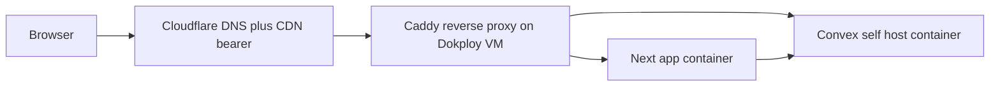

# DEPLOY

Dokploy VM (operator's existing infra) + Cloudflare DNS/CDN bearer + Convex self-host instance.

Decision + rationale: see `adr/deploy-target.md`.

## Topology



## Compose locally

`compose.yaml` at repo root brings up the full operator zoo:

```yaml
services:
  next-app:
    build: ./apps/web
    environment:
      - CONVEX_SELF_HOSTED_URL
      - SITE_URL
      - GOOGLE_CLIENT_ID
      - GOOGLE_CLIENT_SECRET
    depends_on:
      - convex-backend
  convex-backend:
    image: ghcr.io/get-convex/convex-backend:latest
    environment:
      - INSTANCE_NAME
      - INSTANCE_SECRET
    volumes:
      - convex-data:/data
  caddy:
    image: caddy:latest
    volumes:
      - ./Caddyfile:/etc/caddy/Caddyfile
      - caddy-data:/data
    ports:
      - "80:80"
      - "443:443"
volumes:
  convex-data:
  caddy-data:
```

Exact env shape borrowed from claude2b (read at bootstrap time).

## Deploy to Dokploy

```bash
make deploy
```

Equivalent to: build container images → push to registry → dokploy applies compose update → smoke check against deployed URL.

Concrete dokploy CLI invocation copied from claude2b pattern; project ID + dokploy server URL live in operator-local secrets.

## DNS + CDN

Cloudflare:
- A / AAAA records → Dokploy VM IP
- Proxied (orange cloud) → CDN cache active
- Page Rules: `*/s/*` cache-everything, immutable, edge-TTL 1y
- Always Use HTTPS on
- HSTS on
- No Workers, no KV, no D1, no Pages Functions, no R2 Worker bindings (per `adr/deploy-target.md` bearer-mode rules)

## Verifier targets

| Target | Asserts |
|---|---|
| `make verify.local` | Compose stack green, no internet access, full functionality |
| `make verify.bearer` | With CF in front of VM, identical responses + cache headers correct |
| `make verify.fresh` | Bootstrap from clean state + secrets dump, full system green |
| `make smoke` | Deployed URL serves landing + sim routes + share-load round-trip |

## Migration

| From → To | Cost |
|---|---|
| Dokploy VM → other VM | New dokploy deploy, re-point DNS, restore Convex data via `convex export/import`. Hours. |
| Dokploy → K8s cluster | Compose → Helm chart parity already maintained. Apply Helm, re-point DNS. Hours. |
| Cloudflare → other CDN | Re-point DNS. Cache rebuilds from origin. Minutes. |

## Caught by

- `make verify.fresh` periodic ratchet
- Deploy smoke test against deployed URL
- Cloudflare bearer-feature lint asserts no Worker imports
- DNS check (`dig +short`) against expected records as part of post-deploy verification
