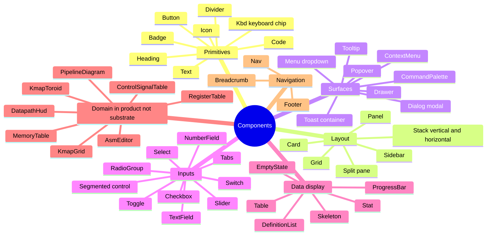

# DESIGN-SYSTEM

Component library catalogue. Substrate-shaped via `packages/design-tokens` + `packages/hud`. Product consumes; no per-feature one-off components.

## Component inventory

## Primitive specs

### Button

| Variant | Use |
|---|---|
| `primary` | Primary action (Save, Sign in) — accent color, solid |
| `secondary` | Secondary action (Reset, Cancel) — outline, neutral |
| `ghost` | Tertiary action (toggle, dismiss) — text only, no border |
| `destructive` | Irreversible action (Delete, Flag) — warning color, requires confirm |
| `link` | Internal navigation styled as text — underline on hover |

| Size | px |
|---|---|
| `xs` | 24 height |
| `sm` | 32 |
| `md` (default) | 40 |
| `lg` | 48 |

Every button:
- Focus ring (2px accent, 2px offset)
- Active press state (10% darken)
- Disabled state (40% opacity, no pointer events)
- Loading state (spinner replaces children, button stays sized)
- Icon-only variant requires `aria-label`

### Icon

- Source: hand-curated Lucide subset (icons that fit industrial aesthetic)
- Stroke width: 1.5px default
- Size: matches surrounding text by default (`1em`), explicit `12/16/20/24/32` allowed
- Color: inherits via `currentColor`

### Text + Heading

Mono font (JetBrains Mono / Berkeley Mono). Sizes from `design-tokens` scale: 12, 14, 16, 20, 28, 40, 64.

| Component | Size | Weight |
|---|---|---|
| `Heading.H1` | 64 | 700 |
| `Heading.H2` | 40 | 700 |
| `Heading.H3` | 28 | 500 |
| `Heading.H4` | 20 | 500 |
| `Text.Body` | 16 | 400 |
| `Text.Caption` | 14 | 400 |
| `Text.Micro` | 12 | 400 |

Tabular nums on for numeric data (`font-variant-numeric: tabular-nums`).

### Code + Kbd

- `Code` inline: monospace, subtle background, slight padding
- `Code` block: monospace, syntax-highlighted, line numbers optional, copy button on hover
- `Kbd`: keyboard key chip, monospace, raised appearance, 12px size

### Badge

Small chip indicator. Variants: `neutral`, `accent`, `warning`, `success`, `info`.

### Divider

Horizontal or vertical hairline.

## Layout specs

### Stack

Spacing between children. Props: `direction` (vertical|horizontal), `gap` (token: xs|sm|md|lg|xl).

### Grid

CSS grid wrapper. Props: `columns`, `gap`, `align`.

### Panel

Container with optional border, padding, background. Used as primary content surface. Variants: `flat`, `outlined`, `elevated`.

### Card

Subset of Panel with consistent padding + optional header/footer slots.

### Split pane

Two-child resizable split. Used for `/compare`. Drag to resize, double-click divider to reset.

### Sidebar

Collapsible side panel. Used for register/memory/signal panes in `/datapath`. Keyboard toggle bound.

## Surface specs

### Dialog (modal)

- Centered, max-width 600px, max-height 80vh
- Backdrop blur (10px)
- Esc closes
- Focus trapped inside
- Returns focus to opener on close
- Animated in/out via `@react-spring/web`

Banned: modals for non-irreversible actions.

### Drawer

- Slides from edge (right or bottom)
- Same focus + Esc rules as Dialog
- Used for settings, my-saves, etc.

### Popover + Tooltip

- Floating UI positioning
- Popover: dismissed by outside-click + Esc, has explicit close button
- Tooltip: shown on hover/focus, dismissed on blur, never has interactive content inside

### Toast container

- Bottom-right by default, top-right alt
- Auto-dismiss after 4s, persistent toasts allowed for irreversible-ack
- Max 3 visible, queue beyond
- Reduced-motion respected

### Menu (dropdown)

- Keyboard nav (arrow keys, Enter to select, Esc to close)
- Search-as-you-type for long menus
- Submenu support (rare)

### CommandPalette

Per `adr/command-palette.md`. Single instance, mounted at root, opened by Cmd+K / `:`.

## Input specs

### TextField

- Label always visible (no placeholder-as-label)
- Helper text + error text slots
- Character count slot (optional)
- Adornments: prefix / suffix icon or text

### NumberField

- Step controls (up/down buttons + arrow keys)
- Range constraints (min/max)
- Format: integer / hex / binary / decimal (configurable per field)
- Tabular nums

### Switch

- Binary on/off
- Toggle animation respects reduced-motion

### Slider

- Step + range
- Tooltip showing value on hover/focus
- Tabular nums

### Select

- Single + multi variants
- Search-as-you-type for long lists
- Virtual scroll above ~50 items

### Tabs

- Horizontal tab list
- Active tab indicator (underline accent)
- Keyboard nav (arrow keys + Home + End)
- Lazy panel content rendering

### Segmented control

- Compact alternative to Tabs for ≤5 options
- Used for "structural / timing" toggle in critical-path, "2D / 3D" toggle in K-map (when applicable)

## Data display

### Table

- Header row sticky on scroll
- Sortable columns (click header)
- Selectable rows optional
- Tabular nums on numeric cells
- Zebra rows optional

### DefinitionList

- Term + definition pairs
- Used for register values, signal values, instruction fields

### Stat

- Large numeric value + label
- Optional delta indicator
- Tabular nums

### ProgressBar + Skeleton

- ProgressBar: determinate (% known) or indeterminate (loading)
- Skeleton: shimmer placeholder while content loads, respects reduced-motion

### EmptyState

- Single line, no illustration, no "Get started!" copy
- Optional CTA button

## Domain components (product side, not substrate)

Listed for completeness; live in `apps/web/features/*/components/`:
- `RegisterTable` — consumes `<Table>`
- `MemoryTable` — consumes `<Table>` with hex+ASCII columns
- `ControlSignalTable` — consumes `<DefinitionList>`
- `DatapathHud` — in-3D overlay via `packages/hud`
- `KmapGrid` (2D) — consumes `<Grid>`
- `KmapToroid` (3D) — three-kit native
- `PipelineDiagram` — consumes `<Table>` with stage-cell sub-components
- `AsmEditor` — consumes `packages/editor`

## Tokens consumed

All components consume `packages/design-tokens`:
- Colors (semantic + accent variants per color-blind mode)
- Spacing (xs, sm, md, lg, xl, 2xl, 3xl)
- Typography scale
- Radii (sm, md, lg)
- Shadows (xs, sm, md, lg)
- Easing curves
- Animation durations

## Foundation demo

`apps/web/learn/foundation/design-system/` — visual catalogue of every component, every variant, every state. Updated on every component change. Acts as Storybook substitute + visual regression baseline source.

## Caught by

- Component-presence lint asserts every component listed here has a `<Name>` export from `packages/hud` or `packages/three-kit`
- Foundation demo route mounts every component; visual regression baselines committed
- A11y test runs `axe-core` on the foundation demo route, zero violations
