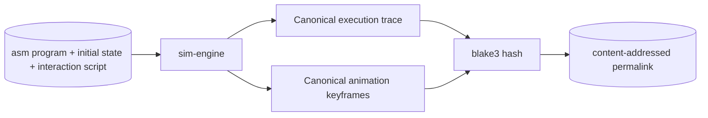

# DETERMINISM

Same input → frame-accurate same output, across machines, across sessions, across time. Required for content-addressed share permalinks to be replay-able and verifiable.

## Contract



The permalink IS the proof that two clients running the same input produce identical results. Hash mismatch = determinism violated.

## Required guarantees

1. **State-machine determinism** — `step(state, input) → state'` is a pure function. No randomness, no clocks, no system state read inside.
2. **Animation determinism** — keyframes are deterministic functions of state + step index + reduced-motion flag (from snapshot schema), not wall-clock-derived. Reduced-motion preserves `stepIndex → visual` mapping with `alpha = 1` (snap-to-end), only suppressing in-between interpolation.
3. **Codec determinism** — `canonicalize(state) → bytes` produces identical bytes across machines for identical state. Key ordering via `safe-stable-stringify`, integer state for numbers, schema-version byte prefix.
4. **Hash determinism** — blake3 of identical bytes = identical hex. **Hash uncompressed canonical bytes, not compressed**. Compression artifacts vary across runtime versions.
5. **Compression for transport only** — use `CompressionStream("deflate-raw")` (universal, no header variance, byte-identical across Chrome/Safari/Firefox/Node 21+/Bun). `Bun.zstdCompress` ONLY for at-rest storage with explicit version pinning (zstd output varies across bun versions + level + window-log).
6. **Cross-machine state+trace hash identity** — same input → identical state hash + trace hash across Linux x86 / macOS arm / Windows / dev laptops. Verified by CI matrix.
7. **GPU pixel hash is per-renderer, NOT cross-machine identical** — visual regression baselines auto-suffix by platform (`name-darwin.png` / `name-linux.png` / `name-win.png`). Pair pixel tests with structural assertions (renderer.info, mesh-position hash) so green pixel isn't only signal. Use SwiftShader-only single baseline for purely-structural traces if GPU diff would otherwise dominate.
8. **Cross-version replay** — old snapshots replay correctly under new code. Schema versions retained; deserializers kept. `__fixtures__/v{N}/*.json` committed at every version; CI replays each migration-chained against current engine, asserts identical `traceHash`.

## Banned in `sim-engine` source

| Pattern | Banned because |
|---|---|
| `Math.random()` | Non-deterministic per call. Use seeded RNG passed in `state`. Recommended: sfc32 (128-bit, fast, excellent PractRand quality), seeded via `blake3(seedString).slice(0,16)` → 4× u32. |
| `Date.now()`, `performance.now()` | System clock leak. Use `state.cycle` or `state.tickCount`. |
| `Object.keys(o)` for iteration order on plain objects | Insertion-order-dependent across runtimes (historically). Use sorted keys explicitly. |
| `JSON.stringify(o)` without replacer | Key order undefined. Use `safe-stable-stringify` canonical helper. |
| `for...in` | Inherited keys vary. Use `Object.entries` after stable sort. |
| `Set` / `Map` in canonical paths | `safe-stable-stringify` silently drops Sets and Maps (stringifies as `{}`). Sort + convert to plain object/array before serialize. Forbid in canonical-path Zod schemas via `.strict()`. |
| `BigInt` in canonical paths | `safe-stable-stringify` default coerces to Number (lossy). Use `{ bigint: 'string' }` option or pre-encode as `{ $bigint: "123" }` envelopes. For MIPS register values use `Int32Array` typed state. |
| `undefined` in canonical paths | Omitted in objects, becomes `null` in arrays. `[undefined, 1]` ≠ `[null, 1]` if round-tripped. Forbid via Zod `.strict().passthrough(false)`. |
| `NaN`, `Infinity`, `-0` | JSON semantics → `null`. Ban in canonical paths via integer state. |
| `requestAnimationFrame` callback state | Frame timing differs per machine. Animation tied to logical step, not wall-clock. |
| Floating-point comparison (`===` on results of computation) | Bit-exact across platforms not always guaranteed. Use typed integer state (Q16.16 fixed-point) where possible. |
| Locale-aware formatting (`toLocaleString`, `Intl.*`) | Locale varies. Use explicit format strings. |
| `Intl.Collator` for canonical sort | Use plain `<` on UTF-16 code units. |
| `Number.prototype.toString` for very small/large floats | Spec variance across runtime versions. Keep state integer. |
| `crypto.randomUUID` for permalink IDs | Non-deterministic. Derive from `blake3(parent || index)` so links are content-addressed end-to-end. |

## Caught by

- `tools/lint/no-determinism-leak.ts` — greps `packages/sim-engine` source for every banned pattern; zero hits required
- Cross-machine golden hash test: same input fixture produces same blake3 hash on CI runners (Linux x86, macOS arm) and developer laptops
- Replay test: old snapshot fixtures committed at each schema version; CI replays each, asserts identical resulting state

## Time abstraction

Inside `sim-engine`:

```ts
type Clock = {
  cycle: number;       // current logical cycle
  stepIndex: number;   // sub-cycle step (0..4 for IF..WB)
  rngSeed: number;     // if any sim ever needs randomness
};
```

Never `new Date()`, never `performance.now()` inside the engine.

Outside the engine (UI, animation player):
- Wall-clock is used for animation duration scheduling
- But the animation FRAMES (keyframes, easing curves) are derived from `state.stepIndex`, not from wall-clock
- Wall-clock affects WHEN a frame renders, never WHAT it renders

## Replay invariants

A snapshot includes:
- Source program (asm or pre-encoded words)
- Initial machine state (registers, memory)
- Interaction script (which UI actions were taken — steps, breakpoints, view changes)
- Schema version

Replaying a snapshot:
1. Load source + initial state
2. Replay interaction script step-by-step
3. Final state must hash-match the snapshot's recorded final-state-hash
4. Frame-N state must hash-match per-frame committed hashes (for animation replay verification)

## Anti-patterns banned in product code

- "Optimization" that introduces non-determinism (e.g., parallel reduce with race in result order)
- Caches keyed by anything other than canonical input hash
- `if (process.env.NODE_ENV === 'development')` branches that change observable state
- Conditional logic on `navigator.userAgent` that alters sim outcomes

## Caught by

- Hash-stability fixture test (per snapshot version)
- Property-based test (`fast-check`): generate random valid input, run twice on same machine, assert identical hash
- Cross-machine CI test: same fixture on Linux + macOS runners, assert identical hash
- Replay smoke test: every old-schema-version fixture replays green
