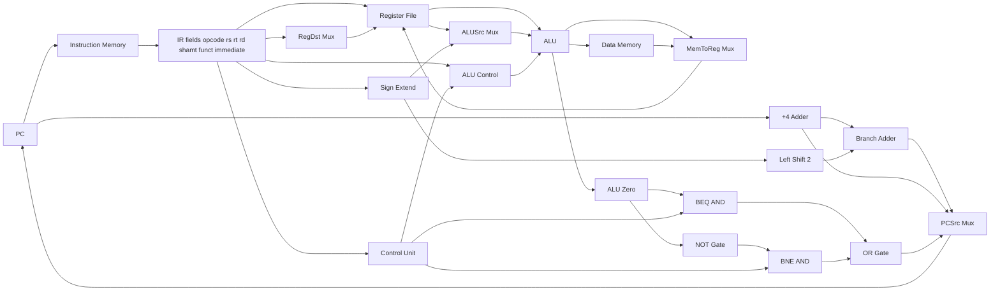

# MIPS-DATAPATH

Locked single-cycle datapath. Topology is the contract. Spec-of-code per `adr/ssot-precedence.md` — CI lint diffs this doc against `apps/web/features/datapath/generated/topology.ts`.

Topology derived from the locked reference implementation (path in agent memory). No structural changes. Aesthetic rendering is greenfield per `UX-DOCTRINE.md`.

## Components

## Component inventory

| Component | Role |
|---|---|
| `PC` | Program counter, 32-bit |
| `IM` | Instruction memory, word-addressable |
| `IR` (implicit) | Field decomposition of the current instruction word |
| `Add4` | PC + 4 adder |
| `BranchAdder` | (Add4 output) + (sign-extended-immediate << 2) |
| `LS2` | Left-shift-2 (for branch offset) |
| `SE` | Sign-extend 16 → 32 |
| `RF` | Register file, 32×32, 2 read ports + 1 write port, `$zero` hardwired |
| `ALU` | 32-bit ALU, op codes per ALU Control |
| `ALUControl` | Derives ALU op from `ALUOp` + funct |
| `DM` | Data memory, word-addressable |
| `Control` | Main control unit, derives 9 base signals from opcode |
| `RegDstMux` | 2-to-1, selects write-register source (rt vs rd) |
| `ALUSrcMux` | 2-to-1, selects ALU op2 (RF read 2 vs sign-extended-immediate) |
| `MemToRegMux` | 2-to-1, selects RF write data (ALU result vs DM read) |
| `PCSrcMux` | 2-to-1, selects next PC (PC+4 vs branch target) |
| `Zero` (ALU flag) | ALU result == 0 |
| `BeqAnd` | AND gate: Branch ∧ Zero |
| `NotGate` | NOT of Zero |
| `BneAnd` | AND gate: BranchNE ∧ ¬Zero |
| `OrGate` | OR of BeqAnd and BneAnd → drives PCSrc |

## Steps

Single-cycle execution conceptually phased as IF / ID / EX / MEM / WB. Phases are presentation only — no latch hardware between them. All logic settles within one clock cycle.

| Step | What happens |
|---|---|
| IF | PC drives IM; IM emits instruction word; PC+4 adder computes next sequential PC |
| ID | IR fields decoded; RF reads rs, rt; SE produces 32-bit immediate; Control emits 9 base signals from opcode |
| EX | ALUSrcMux selects ALU op2; ALU executes; Zero asserted if result = 0; BranchAdder computes branch target |
| MEM | If MemRead: DM[ALU result] read. If MemWrite: DM[ALU result] ← RF read 2. PCSrc resolved via Branch / BranchNE gates |
| WB | MemToRegMux selects RF write data; RegDstMux selects write register; if RegWrite, RF write occurs; PC ← PCSrcMux output |

## Paths

40 named directed paths represent the high-level signal flow. Order does not encode timing within a cycle — all paths conceptually flow within one cycle.

| Path | Source → Destination |
|---|---|
| `PC_TO_IM` | PC → IM address |
| `PC_TO_ADD4` | PC → Add4 input |
| `CONST4_TO_ADD4` | Constant 4 → Add4 input |
| `ADD4_TO_BRANCH_ADDER0` | Add4 output → BranchAdder input 0 |
| `ADD4_TO_PCSRC_MUX0` | Add4 output → PCSrcMux input 0 |
| `PCSRC_MUX_TO_PC` | PCSrcMux output → PC |
| `IM_TO_IR` | IM data out → IR |
| `IR_RS_TO_RF_RR1` | IR rs field → RF read register 1 |
| `IR_RT_TO_RF_RR2` | IR rt field → RF read register 2 |
| `IR_RT_TO_REGDST_MUX0` | IR rt field → RegDstMux input 0 |
| `IR_RD_TO_REGDST_MUX1` | IR rd field → RegDstMux input 1 |
| `REGDST_MUX_TO_RF_WR` | RegDstMux output → RF write register |
| `IR_IMM_TO_SIGN_EXTEND` | IR immediate field → SE input |
| `RF_RD1_TO_ALU1` | RF read data 1 → ALU input 1 |
| `RF_RD2_TO_ALUSRC_MUX0` | RF read data 2 → ALUSrcMux input 0 |
| `SIGN_EXTEND_TO_ALUSRC_MUX1` | SE output → ALUSrcMux input 1 |
| `ALUSRC_MUX_TO_ALU2` | ALUSrcMux output → ALU input 2 |
| `SIGN_EXTEND_TO_LEFT_SHIFT_2` | SE output → LS2 input |
| `LEFT_SHIFT_2_TO_BRANCH_ADDER1` | LS2 output → BranchAdder input 1 |
| `BRANCH_ADDER_TO_PCSRC_MUX1` | BranchAdder output → PCSrcMux input 1 |
| `ALU_TO_DM_ADDR` | ALU result → DM address |
| `RF_RD2_TO_DM_WD` | RF read data 2 → DM write data |
| `ALU_ZERO_TO_BEQ_AND_GATE` | Zero → BeqAnd input |
| `BRANCH_TO_BEQ_AND_GATE` | Control Branch signal → BeqAnd input |
| `ALU_ZERO_TO_NOT_GATE` | Zero → NotGate input |
| `NOT_GATE_TO_BNE_AND_GATE` | NotGate output → BneAnd input |
| `BRANCHNE_TO_BNE_AND_GATE` | Control BranchNE signal → BneAnd input |
| `BEQ_AND_GATE_TO_OR_GATE` | BeqAnd output → OrGate input |
| `BNE_AND_GATE_TO_OR_GATE` | BneAnd output → OrGate input |
| `OR_GATE_TO_PCSRC_MUX` | OrGate output → PCSrcMux select |
| `ALU_TO_MEMTOREG_MUX0` | ALU result → MemToRegMux input 0 |
| `DM_RD_TO_MEMTOREG_MUX1` | DM read data → MemToRegMux input 1 |
| `MEMTOREG_MUX_TO_RF_WD` | MemToRegMux output → RF write data |
| `IR_OPCODE_TO_CONTROL` | IR opcode → Control input |
| `CONTROL_TO_REGDST_MUX` | Control RegDst signal → RegDstMux select |
| `CONTROL_TO_ALUSRC_MUX` | Control ALUSrc signal → ALUSrcMux select |
| `CONTROL_TO_MEMTOREG_MUX` | Control MemToReg signal → MemToRegMux select |
| `CONTROL_TO_REGWRITE` | Control RegWrite signal → RF write enable |
| `CONTROL_TO_MEMREAD` | Control MemRead signal → DM read enable |
| `CONTROL_TO_MEMWRITE` | Control MemWrite signal → DM write enable |
| `IR_FUNCT_TO_ALU_CONTROL` | IR funct → ALUControl input |
| `ALUOP_TO_ALU_CONTROL` | Control ALUOp → ALUControl input |
| `ALU_CONTROL_TO_ALU` | ALUControl output → ALU op select |

## Segments

Visual sub-paths exist for 3D routing with junctions and jumps. Driven by the same path graph above but split for clean spatial layout. Concrete segment names live in `apps/web/features/datapath/generated/topology.ts` (codegen target).

## Value IDs (named carriers)

| Value ID | Carrier |
|---|---|
| `PC` | Program counter value |
| `ADD4` | PC + 4 value |
| `BRANCH_ADDER` | Branch target value |
| `SIGN_EXTEND` | 32-bit sign-extended immediate |
| `LEFT_SHIFT_2` | Shifted-by-2 immediate |
| `IM_ADDRESS` | Instruction memory address |
| `IM_INSTRUCTION` | Fetched instruction word |
| `IR_OPCODE` | 6-bit opcode field |
| `IR_RS` | 5-bit rs field |
| `IR_RT` | 5-bit rt field |
| `IR_RD` | 5-bit rd field |
| `IR_SHAMT` | 5-bit shamt field |
| `IR_FUNCT` | 6-bit funct field |
| `IR_IMMEDIATE` | 16-bit immediate field |
| `RF_RR1` | RF read register 1 address |
| `RF_RR2` | RF read register 2 address |
| `RF_WR` | RF write register address |
| `RF_RD1` | RF read data 1 |
| `RF_RD2` | RF read data 2 |
| `RF_WD` | RF write data |
| `ALU_OP1` | ALU operand 1 |
| `ALU_OP2` | ALU operand 2 |
| `ALU_RESULT` | ALU output value |
| `ALU_ZERO` | ALU zero flag |
| `DM_ADDRESS` | Data memory address |
| `DM_WRITE_DATA` | Data memory write data |
| `DM_READ_DATA` | Data memory read data |

## Control signals

Base signals (9), produced by Control from opcode:

| Signal | Type | Meaning |
|---|---|---|
| `RegDst` | `0 \| 1 \| X` | RegDstMux select: 0 = rt, 1 = rd, X = don't-care |
| `ALUSrc` | `0 \| 1` | ALUSrcMux select: 0 = RF read 2, 1 = sign-extended immediate |
| `MemToReg` | `0 \| 1 \| X` | MemToRegMux select: 0 = ALU result, 1 = DM read, X = don't-care |
| `RegWrite` | `0 \| 1` | RF write enable |
| `MemRead` | `0 \| 1` | DM read enable |
| `MemWrite` | `0 \| 1` | DM write enable |
| `Branch` | `0 \| 1` | BEQ enable (gates BeqAnd) |
| `BranchNE` | `0 \| 1` | BNE enable (gates BneAnd) |
| `ALUOp` | `00 \| 01 \| 10` | ALU operation class (drives ALUControl) |

Runtime-derived signal (1):

| Signal | Type | Meaning |
|---|---|---|
| `PCSrc` | `0 \| 1` | Output of OrGate(BeqAnd, BneAnd). Selects next PC: 0 = PC+4, 1 = branch target |

## Control truth table

Per locked datapath subset. `X` = don't-care (any value, gate is downstream-irrelevant for this instruction).

| Mnemonic | RegDst | ALUSrc | MemToReg | RegWrite | MemRead | MemWrite | Branch | BranchNE | ALUOp |
|---|---|---|---|---|---|---|---|---|---|
| `add` | 1 | 0 | 0 | 1 | 0 | 0 | 0 | 0 | 10 |
| `sub` | 1 | 0 | 0 | 1 | 0 | 0 | 0 | 0 | 10 |
| `and` | 1 | 0 | 0 | 1 | 0 | 0 | 0 | 0 | 10 |
| `or` | 1 | 0 | 0 | 1 | 0 | 0 | 0 | 0 | 10 |
| `slt` | 1 | 0 | 0 | 1 | 0 | 0 | 0 | 0 | 10 |
| `addi` | 0 | 1 | 0 | 1 | 0 | 0 | 0 | 0 | 00 |
| `lw` | 0 | 1 | 1 | 1 | 1 | 0 | 0 | 0 | 00 |
| `sw` | X | 1 | X | 0 | 0 | 1 | 0 | 0 | 00 |
| `beq` | X | 0 | X | 0 | 0 | 0 | 1 | 0 | 01 |
| `bne` | X | 0 | X | 0 | 0 | 0 | 0 | 1 | 01 |

## ALU Control

ALUOp + funct → ALU operation:

| ALUOp | funct | ALU op |
|---|---|---|
| `00` | — | add (lw, sw, addi address calc) |
| `01` | — | sub (beq, bne comparison via subtract-and-zero) |
| `10` | 0x20 | add |
| `10` | 0x22 | sub |
| `10` | 0x24 | and |
| `10` | 0x25 | or |
| `10` | 0x27 | nor |
| `10` | 0x2a | slt |

## Per-instruction step traces

Per-instruction step traces (which paths active in which step, which values appear where) are codegen output under `apps/web/features/datapath/generated/stepTraces.ts`, derived from this doc + the executor in `apps/web/features/datapath/core/`. Spec-of-code lint diffs.

## Cross-link with K-map

The 9 base control signals are each Boolean functions over the opcode bits (and partially funct bits for ALU Control). K-map tool ingests the truth table column-by-column (e.g., `RegDst(opcode[5..0])`, `ALUSrc(opcode[5..0])`) and visualizes minimization. The headline pedagogy: derive `RegDst` in K-map, then watch the same function fire in the datapath as different instructions step through. Per `KMAP.md` "Datapath cross-link".

## Caught by

- Spec-of-code lint diffs:
  - Component inventory ↔ scene-component table in code
  - Paths table ↔ generated path enum
  - Value IDs table ↔ generated value-id enum
  - Control truth table ↔ generated control table
  - ALU Control table ↔ generated ALU control logic
- Golden-trace test: each instruction's per-step trace matches committed golden
