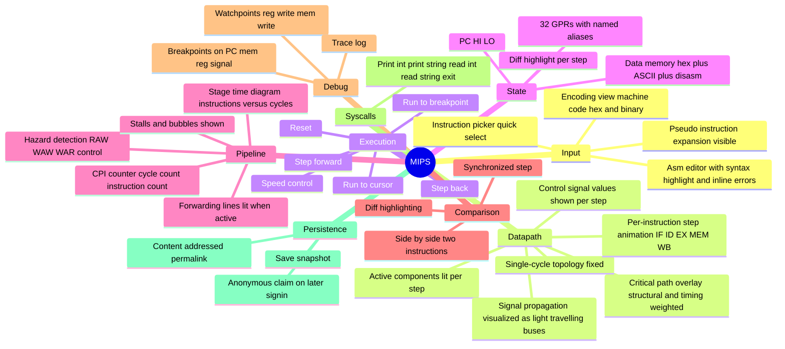
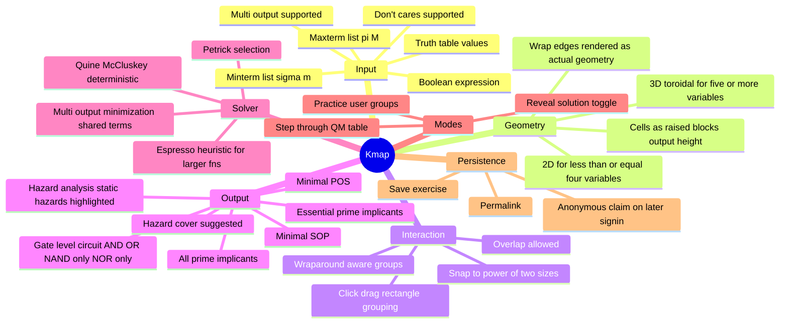

# REQUIREMENTS

Locked floor for the product. Every item ships. Items outside the floor live in `NON-GOALS.md` with trigger.

## MIPS visualizer

### Instruction set

- **Datapath-animated floor**: `add addi and beq bne lw slt or sw sub`
- **Encodable floor**: + `andi j lui nor ori sll srl`
- **Full MIPS32 ratchet**: every official instruction grinds in per "only more never less"

### Datapath topology

Single-cycle MIPS datapath, CS2100-variant (no school refs in product surface). Topology, paths, segments, value ids, control signals frozen against the reference implementation at `~/mips/ref/src/core/mips/single-cycle/`. See `MIPS-DATAPATH.md`.

### Control signals

`RegDst`, `ALUSrc`, `MemToReg`, `RegWrite`, `MemRead`, `MemWrite`, `Branch`, `BranchNE`, `ALUOp ∈ {00,01,10}`, `PCSrc` (derived). See `MIPS-DATAPATH.md`.

## K-map tool

### Variable range

2 to 6 variables. Beyond 6 → Espresso heuristic, no K-map geometry (out of scope, see `NON-GOALS.md`).

## Cross-sim integration

The MIPS datapath's Control unit and ALU Control are themselves Boolean functions. The K-map tool can ingest the truth table of any control signal as a function of `(opcode, funct)` and visualize its minimization. This link is the headline pedagogy of the product. See `KMAP.md` "Datapath cross-link".

## Persistence

- Anonymous-first, all features available without signin
- Save / share / permalink for every sim state, content-addressed
- Optional signin claims anonymous saves
- See `AUTH.md`, `PERSISTENCE.md`

## Deploy

- Dokploy VM + Cloudflare DNS + Convex self-host instance
- Local-first hostability invariant — same stack runs in compose on a MacBook
- See `DEPLOY.md`

## Quality floor

- 60 fps on mid-tier laptop hardware
- WebGPU primary, WebGL fallback
- Keyboard-first, every action invocable without mouse
- WCAG AA, reduced-motion respected
- Deterministic sim engine, golden-trace tested
- Substrate published OSS with foundation-app demos
