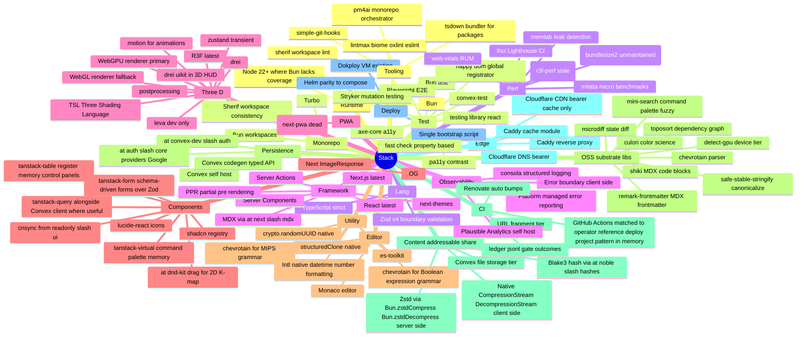

# STACK

Locked picks per layer. Every named pick is spec-of-code per `book/HARD-RULES.md` "STACK-presence lint mandatory" — CI verifies each pick is actually consumed. Conformance with pm4ai `ALL_BANNED` map (operator-wide banned-deps catalog at `/Users/o/z/pm4ai/packages/pm4ai/src/banned.ts`) is mandatory; banned alternatives never enter dep manifests.

## Picks per layer

## Concrete versions

Per `book/PHILOSOPHY.md` Latest-only rule — every direct dep tracks upstream latest. Lockfile is build-artifact, not source-of-truth. The version catalog source-of-truth lives in `apps/web/package.json` + `packages/*/package.json` direct deps. CI staleness gate (`tools/lint/check-staleness.ts`) fires on any dep with no upstream release in 6 months.

## Substrate package stack

| Package | Concern | Owned externalities |
|---|---|---|
| `three-kit` | R3F + drei + drei-uikit + postprocessing + TSL helpers + material library + camera grammar | R3F ecosystem |
| `hud` | In-3D UI chrome backed by drei-uikit | drei-uikit |
| `design-tokens` | Palette, typography, spacing, motion easing | None (TS only) |
| `sim-engine` | Deterministic state machine + scrub + snapshot codec (blake3 + zstd + canonicalize) | `@noble/hashes` for blake3, `Bun.zstdCompress`/`Bun.zstdDecompress` server-side + native `CompressionStream`/`DecompressionStream` client-side |
| `editor` | Monaco wrapper + chevrotain grammar wiring | Monaco, chevrotain |
| `bits` | Two's complement, sign-extend, hex / bin / dec conversions, bit slicing | None |
| `boolean` | Truth table, QM, Petrick, Espresso, prime implicants, hazard analysis | None (or OSS solver wrapped per audit) |

OSS-import-first scan per package logged in the package's ADR — see `adr/three-stack.md`, `adr/editor-monaco.md`, `adr/boolean-package.md`, etc.

## Product app stack

`apps/web` (Next.js):
- Routes: `/` landing, `/datapath` MIPS sim, `/kmap` K-map tool, `/pipeline` pipeline view, `/compare` side-by-side, `/learn/*` MDX explainers, `/s/[hash]` shared snapshot, `/me` (auth-gated, optional)
- Server: RSC + Server Actions for save/share/assemble, Route Handlers for Convex webhooks
- Client: 3D canvas islands, Monaco editor, zustand stores, motion transitions
- Components: shadcn registry primitives + cnsync (operator's `readonly/ui` workspace) — Button, Dialog, Drawer, Tabs, Tooltip, Popover, Sheet, Toast, etc.
- Forms: `@tanstack/react-form` + Zod resolver
- Tables: `@tanstack/react-table` for register/memory/control panels
- Virtualization: `@tanstack/react-virtual` for command palette + memory address list
- Drag: `@dnd-kit` for 2D K-map cell drag-grouping (3D toroidal uses in-canvas R3F drag)
- Icons: `lucide-react`
- Themes: `next-themes` provider
- Auth: `@convex-dev/auth` + `@auth/core/providers/google` (matches operator's reference Convex+auth project pattern in memory), anon-first, signin = optional cross-device persistence
- Convex client: `convex` + `@convex-dev/auth` React bindings

## Convex backend stack

`apps/backend`:
- Convex self-host instance reachable via `CONVEX_SELF_HOSTED_URL`
- Schema: snapshots, users, userProfiles (mirrors operator's reference profile-with-role pattern in memory), share-index
- Functions: `saveSnapshot`, `loadSnapshot`, `claimAnonSnapshots`, auth callbacks
- Auth providers: Google via `@auth/core/providers/google`
- File storage: Convex built-in for snapshot bodies >1KB
- Scheduled jobs: abuse-flag sweeps if/when triggered

## Worker concurrency (no banned deps)

Per `CONCURRENCY.md` + pm4ai `worker` ban on `comlink` / `workerpool` / `threads` / `tinypool` / `piscina` / `worker-threads-pool`:

- Workers spawned via native `new Worker(url)` / `new SharedWorker(url)` — Bun + browsers handle natively
- Worker RPC: thin typed wrapper around `postMessage` + `MessageChannel` (≤ 30 LOC per worker class, hand-roll justified per `adr/oss-import-audit.md`)
- Worker pool: thin scheduler over native Workers with work-stealing extension (~ 50 LOC, hand-roll justified)
- Transferable handoff via `Transferable` array on `postMessage`

## Operator zoo (compose locally + Helm in cluster)

Same images, same env shape, same bootstrap. Scale parameters differ between deployment topologies.

| Service | Image |
|---|---|
| `next-app` | Built from `apps/web` Dockerfile, Next standalone output |
| `convex-backend` | `ghcr.io/get-convex/convex-backend:latest` (self-host) |
| `caddy` | `caddy:latest` with cache module |
| `plausible` | Self-host Plausible Analytics container |

## Verifier targets

- `make verify.local` — pure self-host stack green
- `make verify.bearer` — with Cloudflare CDN + DNS in front, green
- `make verify.fresh` — bootstrap from secrets dump + clean state, green
- All three exercised periodically per `book/PHILOSOPHY.md` "Seamless machine migration"

## Caught by

- Stack-presence lint per pick (`tools/lint/stack-presence.ts`)
- Staleness gate (`tools/lint/check-staleness.ts`)
- OSS-import-first lint (`tools/lint/oss-import-first.ts`) per `adr/oss-import-audit.md` — hand-roll without rejection-rationale entry = violation
- **pm4ai banned-deps lint** (operator-wide via lintmax + per-project check) — any dep matching `/Users/o/z/pm4ai/packages/pm4ai/src/banned.ts` `ALL_BANNED` entries fails CI
- ADR-presence lint — every pick on this page has an ADR file under `adr/`
- Spec-of-code allowlist entry — `STACK.md` is itself spec-of-code per `book/HARD-RULES.md`
