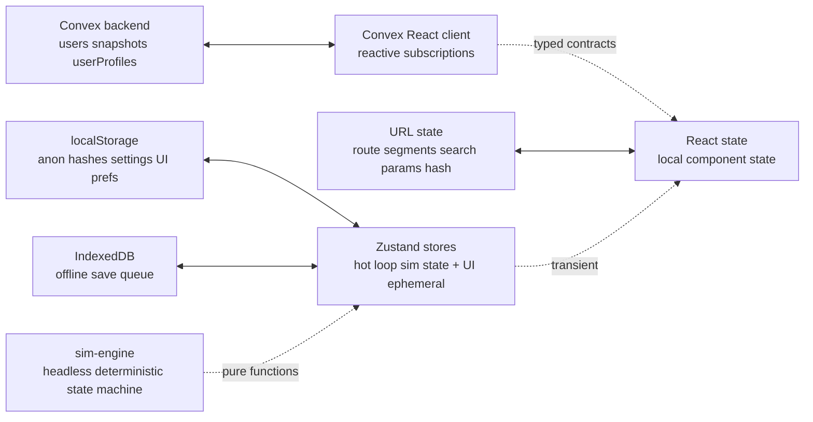

# STATE-MANAGEMENT

Boundaries between state layers. Each piece of state lives in exactly one layer per `book/HARD-RULES.md` "Every fact one home".

## Layers

## Per-layer ownership

### Convex backend (server SSOT)

Owns:
- Persisted user identity (per `@convex-dev/auth`)
- Persisted user profiles + roles
- Persisted snapshots (content-addressed)
- Anonymous-claim audit log
- Abuse-flag metadata

Read via: Convex query (reactive) or RSC (server-side)
Write via: Convex mutation

### URL state

Owns:
- Current route (`/datapath`, `/kmap`, etc.)
- Selected instruction (`?instr=add`)
- Current step (`?step=EX`)
- Shared snapshot hash (`/s/<hash>` or `/s#<fragment>`)
- View mode (`?view=survey | study | compare`)
- Camera bookmark (`?cam=alu-closeup`)

Read via: Next router + `useSearchParams`
Write via: Router push / replace

Shareable state belongs here. Anything that should round-trip via permalink lives in URL.

### localStorage

Owns:
- Anonymous-saved hashes (for claim-on-signin)
- Theme palette variant (if alternates landed)
- Reduced-motion override (operator-set, overrides browser)
- Onboarding-dismissed flag
- Editor preferences (font size, key bindings if user-configurable)

Read via: `useLocalStorage` hook
Write via: same

Per-device preferences, no need to roundtrip URL or hit Convex.

**Zustand `persist` + RSC**: `skipHydration: true` mandatory; otherwise first paint diverges. Server renders defaults; client rehydrates in `useEffect`. `partialize` strictly allowlist (never denylist) so sim-slice keys never leak into localStorage.

### IndexedDB

Owns:
- Offline save queue (per `adr/offline-pwa.md`)
- Cached learn page bundles
- Cached example bundles

Read/write via: idb-keyval or Workbox-managed cache

### Zustand (transient + ephemeral UI)

Owns:
- Current sim engine state (mutable, hot-loop, frame-by-frame)
- Current animation state (playing / paused / step index)
- Current selected K-map groupings (in-progress)
- Modal / dialog open state
- Toast queue
- Command palette open state + query

Read via: `useStore(selector)` with shallow comparison
Write via: store actions (typed)

Use `subscribeWithSelector` for transient subscriptions outside React render (per `PERFORMANCE.md` patterns).

### React state

Owns:
- Local form input drafts (before submit)
- Hover / focus states for individual components
- One-off ephemeral UI state not worth zustand

Default fallback when none of the above layers fit.

### sim-engine (headless)

Owns nothing persistent. Pure functions over state passed in. State is held by zustand; sim-engine produces next state per step. Per `DETERMINISM.md`.

### Convex optimistic vs `useOptimistic`

When mutating Convex data, use **Convex's `useMutation().withOptimisticUpdate()`** (integrates with reactive store, auto-rollback on error). Reserve React 19 `useOptimistic` for non-Convex Server Actions only. Mixing both causes double-flicker.

## Decision matrix

| Question | Layer |
|---|---|
| Should this round-trip via permalink? | URL |
| Should this persist across devices? | Convex |
| Should this persist on this device only? | localStorage |
| Should this work offline + reconcile when online? | IndexedDB |
| Is this mutating frame-by-frame? | Zustand transient |
| Is this scoped to one component only? | React state |
| Is this a pure transformation of inputs? | sim-engine (no state) |

## Anti-patterns banned

- Persisting frame-loop state to localStorage (would thrash storage)
- Storing URL-derivable state in zustand (duplication, drift)
- React state for cross-component state (lift to zustand)
- Convex mutation for ephemeral UI state (latency, cost)
- Local-only state for share-worthy state (would lose on share)

## Hydration

RSC initial render reads URL + cookies. Client hydrates with that state + reads localStorage / IndexedDB after mount. No flash of unstyled content; reduced-motion / palette decisions made server-side via cookie hints.

## Caught by

- `tools/lint/state-layer.ts` greps `apps/web` for cross-layer-violation patterns (e.g., localStorage writes in a server component, Convex calls inside Zustand stores)
- E2E test: navigation preserves URL state but resets Zustand transient state
- Smoke: refresh page → URL state survives, localStorage state survives, zustand state resets to initial
