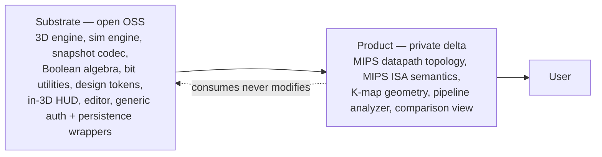

# SUBSTRATE-VS-PRODUCT

Per `book/SUBSTRATE.md` mindset. Product is the smallest delta on a published substrate. Substrate carries every primitive that another sim or learning tool would also need; product carries only what is genuinely specific to MIPS datapath + K-map.

## Split

## Substrate packages

| Package | Concern |
|---|---|
| `three-kit` | R3F + drei + TSL helpers, signal-pulse shader, material library (PCB, brushed metal, glass, emissive trace), camera grammar, postprocessing presets, contact shadows, instancing helpers |
| `hud` | In-3D UI chrome (uikit panels, telemetry readouts, breadcrumb, command palette in 3D) |
| `design-tokens` | Palette, type, spacing, motion easing curves, animation duration tokens |
| `sim-engine` | Deterministic state machine pattern, trace, scrub, breakpoint, snapshot codec (canonicalize, blake3, serialize, deserialize, schema versioning) |
| `editor` | Monaco wrapper, custom language wiring, error markers, theme integration |
| `bits` | Two's complement, sign-extend, binary/hex/decimal conversions, bit slicing, byte ordering |
| `boolean` | Truth table, minterm/maxterm list, Quine-McCluskey, Petrick selection, Espresso heuristic, prime implicants, essential PIs, minimal SOP, minimal POS, hazard analysis |

Each package ships with foundation-app demo proving the primitive against a generic example (not MIPS-shaped, not K-map-shaped). Foundation app is part of the substrate showcase, not the product.

## Product modules

| Module | Concern |
|---|---|
| `features/datapath` | Single-cycle MIPS topology, paths, segments, value-ids, control signals, step animation choreography |
| `features/datapath/core` | ISA encoder, ISA decoder, machine state, execution step (consumes `sim-engine` + `bits`) |
| `features/pipeline` | Stage-time diagram, hazard detection, forwarding overlay (consumes single-cycle traces) |
| `features/kmap` | 2D ≤4-var grid, 3D toroidal ≥5-var geometry, grouping interaction (consumes `boolean` for solving) |
| `features/critical-path` | Structural + timing-weighted critical path analyzer |
| `features/compare` | Side-by-side instruction comparator |
| `features/learn` | MDX explainer content with embedded 3D islands |

## Anti-patterns watched

- **Substrate accumulating MIPS or K-map knowledge** — substrate stays domain-agnostic. The boolean package solves any Boolean function; it does not know about Control or ALUOp. The sim-engine handles any deterministic state machine; it does not know about PC or register files. Caught by: substrate package source greps for MIPS / K-map / domain vocab in CI lint.
- **Product re-implementing substrate concerns** — every commit in `apps/web` reviewed against "is there a substrate package that owns this?". Caught by: lint scan for code shapes that match existing substrate primitives.
- **Premature publication** — substrate source is OSS-public, but installable artifacts (npm) are not published until a second consumer exists. Until then, substrate is consumed via workspace dependency only. Caught by: package.json `private: true` until a second consumer materializes.

## Growth loop

Each new sim adopted onto this stack runs `book/SUBSTRATE.md` audit-then-batch-then-product sequence:

1. Deep requirements analysis (no solutioning)
2. Stack-completeness audit — gaps land as ADR + STACK update + version-catalog addition + foundation-app demo, all before any product code
3. Boilerplate-extraction audit — cross-feature shapes collapse to substrate primitives + foundation demo
4. Substrate execution batch (substrate first, foundation demo, tests)
5. Product implementation as thin delta

For the locked initial sims (MIPS datapath + K-map + pipeline + critical path + compare): steps 1-4 are this docs corpus. Step 5 starts when docs are green.
