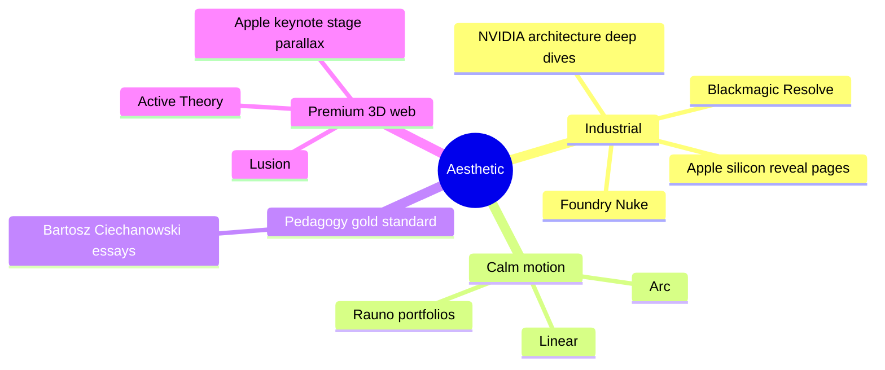

# UX-DOCTRINE

Visual + interaction rules for the product surface. Pedagogy is the product; motion is informative; aesthetic is professional silicon, never gamified, never childish.

## Reference vibe

Banned vibes: game UI, neon rainbow, comic-sans-adjacent, anything "fun edutech", gamification badges, achievement toasts, level-up sounds, mascots.

## Palette

- Background: near-black, single tone, no gradient
- Foreground primary: warm off-white for text and chrome
- Foreground secondary: cool gray for tertiary text
- Single accent: cyan-leaning for active signal / highlight (locked unless overridden by future ADR)
- Single warning accent: amber for hazards, breakpoint hits, errors
- Reductive palette enforced — no more than five named hues across the entire product

Material palette (3D scene):
- Silicon die: machined-aluminum PBR, brushed normal, baked AO
- Buses / wires: emissive trace material, tunable intensity, energy travels as luminous pulse
- Glass enclosures: drei MeshTransmissionMaterial with low chromatic aberration
- PCB substrate: FR4-shaped color, micro-detail via normal map
- Active component glow: accent-tinted emissive when signal is live, otherwise inert

## Typography

- Mono: JetBrains Mono or Berkeley Mono, weights 400/500/700
- Tabular nums for every register value, every counter, every signal value
- Display: variable mono or proportional grotesque at large sizes only (h1 headings, brand-when-named)
- Size scale: 12 / 14 / 16 / 20 / 28 / 40 / 64, no in-between
- Line-height tight on data, generous on prose

## Motion

- Every transition encodes a state change — no purely decorative animation
- Default easing: `cubic-bezier(0.2, 0.8, 0.2, 1)` ("smooth-out", calm, premium)
- Spring physics on interactive elements: drag a wire and it has tension; click a register and the drawer slides with weight; hover a signal and it lifts subtly
- Reduced-motion respected — animations collapse to instantaneous state swaps when `prefers-reduced-motion: reduce`
- Stage transitions in datapath: depth-of-field focus pulls to active component, restrained, ~400-600ms
- Signal propagation along buses: physically plausible falloff, never instantaneous "all lights on at once"
- Camera moves: dolly + cut, never spinning, never roller-coaster, never "wow we did 3D" rotation

## Camera grammar

- Bookmarked views per scene: whole-datapath, ALU close-up, register file iso, control unit, memory close-up, pipeline side-view
- Smooth dolly between bookmarks, ~800ms easing
- Free-orbit available but tertiary — bookmarks are primary
- Keyboard 1-9 jump to bookmarks
- Mouse drag = orbit, scroll = dolly, right-drag = pan (standard CAD-like)

## Depth and lighting

- One key directional light + HDRI environment for global PBR reflections (drei `Environment` studio preset)
- Contact shadows beneath every grounded component
- Subtle bloom restrained — never bloom-soup
- Layered depth-of-field focus pulls to active stage
- SSAO baked into screen-space ambient occlusion via postprocessing

## Diegetic readouts

Values render *on* the silicon (decals, etched labels) where the geometry allows, not floating in space:
- Register file: register names + current values etched on the face
- ALU: result + zero flag readable from the surface
- Control unit: signal name plates with current value light
- Memory: address + word values laid out as physical grid

Tooltips exist but tertiary — surface labels carry the primary data.

## In-3D HUD vs DOM HUD

- In-3D HUD (`packages/hud`, uikit-backed): floats with the scene, follows the camera, sharper than `Html` drei overlays, used for telemetry that should feel part of the scene (signal value annotations, breakpoint pins)
- DOM HUD: editor, register table, memory table, control table, K-map cell input, asm output — anything dense + text-heavy

Both share design tokens.

## Keyboard-first

Every action invocable without mouse:
- Space: step / play-pause
- Left / Right: prev / next cycle
- R: reset
- B: toggle breakpoint at cursor
- 1-9: jump to bookmarked camera view
- `:` (colon): open command palette
- `/`: search registers / memory / signals

Mouse is acceleration, never required.

## Layout density

Modes:
- **Survey**: 3D scene fills viewport, HUDs collapsed to edge dock
- **Study**: 3D scene + register/memory/control tables visible side panel
- **Compare**: split-pane, two scenes synchronized

User toggles via keyboard. Default = Study on first load.

## Sound

None. Silent product. No click sounds, no step sounds, no success chimes. Visual feedback is sufficient.

## Loading + Suspense

- Initial 3D scene load behind drei `Loader` with subtle progress, no spinner, no "loading..." copy
- Per-route streaming Suspense with skeleton geometry (low-poly placeholder) that morphs into full detail when ready
- Asset preload hints from RSC (`packages/three-kit` exposes preload helpers)

## Empty / error states

- Empty: a one-line domain prompt, never illustration, never "let's get started!"
- Error: the failure quoted exact, the offending input shown, the next action implied — no apology, no recovery suggestion if the user already knows what to do

## Accessibility

- WCAG AA contrast minimum on every chrome / data surface
- Full keyboard nav
- Reduced motion respected
- Focus rings visible (custom-styled but not removed)
- Screen-reader labels on every interactive 3D element via aria attached to invisible DOM proxies
- Color is never the only carrier of meaning (hazards = amber AND icon AND label)

## Anti-patterns banned

- Emojis in product copy
- Achievement / progress / streak surfaces
- Onboarding tutorials with forced step-through (a single inline hint on first sim load, dismissible, never returns)
- Confetti / celebration animations
- "Pro tip" callouts
- Sticky bottom-of-screen CTA bars
- Modal popups for non-irreversible actions
- Loading copy beyond skeleton geometry
- Auto-rotating 3D scenes when idle (banned — calm by default)
