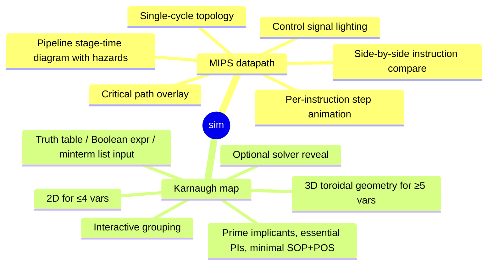

# VISION

Interactive 3D visualizer for low-level digital logic and computer architecture concepts.

Two sims today, both world-class, both pedagogically superior to every 2D equivalent that exists:

The shape recurs: substrate carries every generic primitive (3D engine, sim engine, snapshot codec, Boolean algebra, bit utilities, design tokens, in-3D HUD, editor). Each new sim is a thin product delta on the same substrate. The substrate grows with each sim; the product shrinks.

## Why 3D

3D earns its place where 2D loses signal:

- **MIPS datapath**: physical depth lets stages, registers, ALU, memory, control unit live as machined silicon blocks with emissive bus traces. Camera moves between high-level survey (whole datapath) and stage-level close-up (ALU internals during EX) — both are the same scene, just camera cuts. Signal propagation is physically plausible light traveling along buses. The pedagogy gain is intuitive: students see the *thing* not a flowchart of the thing.
- **K-map (≥5 vars)**: 5 and 6-variable K-maps are notoriously confusing in 2D because wraparound across "split maps" is invisible. The genuine geometry is toroidal. 3D renders the actual torus or stacked-layer model with visible wrap edges. The 2D split-map presentation rots; 3D is honest.

## Aesthetic

Reference vibe (not games, not toys, not edutech-shaped):

- Apple silicon reveal pages — die shots, exploded chips, slow parallax
- NVIDIA architecture deep dives
- Linear / Arc / Rauno's portfolios — calm monochrome motion
- Bartosz Ciechanowski essays — interactive pedagogy gold standard, translated to 3D
- Foundry's Nuke, Blackmagic Resolve — pro tool chrome, dense but ordered

Concrete: near-black background, single accent, machined-silicon material library, restrained bloom, real depth-of-field focus pulls during stage transitions, type as UI (mono tabular nums), spring physics on every interactive element. See `UX-DOCTRINE.md`.

## Audience

Learners exploring low-level computer architecture and digital logic. Anonymous by default. Login optional, sole purpose cross-device persistence. See `USERS.md`, `AUTH.md`.

## Floor, never ceiling

Every locked scope item is the minimum. Direction is always more strictness, more coverage, more polish, more substrate richness. No phasing, no MVP carve-outs, no defer-for-simplicity. See `book/PHILOSOPHY.md` rule "Unlimited rework pre-launch" + `NON-GOALS.md` for codified scope defenses.
