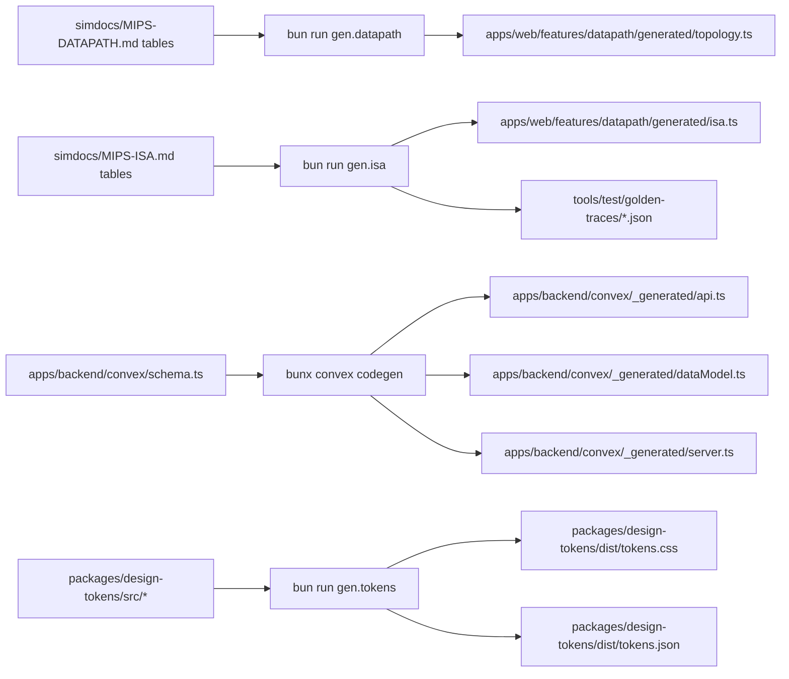

# codegen-pipeline

Codegen owns every fact derivable from another fact. Hand-typed duplicates are violations.

## Pipelines



## Properties

- All codegen outputs land under `generated/` paths and are committed per `book/HARD-RULES.md` "Generated artifacts committed; CI verifies regeneration".
- Pre-commit hook regenerates and diffs; staleness fails CI.
- Hand-editing a `generated/` file = violation.
- Regeneration is idempotent — running `make gen` twice produces zero diff.

## `make gen` orchestration

```
make gen:
  bun run gen.datapath
  bun run gen.isa
  bunx --filter=backend convex codegen --typecheck disable
  bun run gen.tokens
```

`make gen.check` regenerates into a temp dir and diffs against committed outputs; non-zero diff = stale = CI fail.

## Caught by

- `gen.check` CI gate.
- Pre-commit hook fires `gen` + adds resulting changes.
- Hand-editing-generated lint scans `generated/` paths for non-codegen-shape edits.
