# foundation-bootstrap-order

Topological phase order. Every phase is a foundation that subsequent phases lean on. Lint-before-artifact enforced per `book/HARD-RULES.md`.

```mermaid
flowchart TD
    P0[Phase 0 — Repo skeleton] --> P1
    P1[Phase 1 — Tooling: lintmax + sherif + simple-git-hooks + tsdown + turbo + pm4ai] --> P2
    P2[Phase 2 — Substrate packages — design-tokens, bits, boolean — pure TS] --> P3
    P3[Phase 3 — Substrate engine — sim-engine] --> P4
    P4[Phase 4 — Substrate 3D — three-kit + hud] --> P5
    P5[Phase 5 — Substrate editor — editor wrapper] --> P6
    P6[Phase 6 — Foundation app shell — apps/web routes + RSC + auth + Convex backend wiring] --> P7
    P7[Phase 7 — Foundation demos — one per substrate package] --> P8
    P8[Phase 8 — Product feature: datapath core — ISA decoder + machine state + executor] --> P9
    P9[Phase 9 — Product feature: datapath 3D scene] --> P10
    P10[Phase 10 — Product feature: kmap core + 2D scene] --> P11
    P11[Phase 11 — Product feature: kmap 3D toroidal scene] --> P12
    P12[Phase 12 — Product feature: pipeline analyzer + diagram] --> P13
    P13[Phase 13 — Product feature: critical path overlay] --> P14
    P14[Phase 14 — Product feature: side-by-side compare] --> P15
    P15[Phase 15 — Persistence + share permalinks] --> P16
    P16[Phase 16 — Learn MDX pages + interactive islands] --> P17
    P17[Phase 17 — Deploy: dokploy + Cloudflare + Convex instance] --> P18
    P18[Phase 18 — Polish ratchet: a11y, perf, golden-trace tests, mutation tests, verify.fresh]
```

## Phase 0 — Repo skeleton

`sim` repo: `package.json` (bun workspaces), `turbo.json`, `tsconfig.json`, `Makefile`, `compose.yaml` placeholder, `.gitignore`, `up.sh`, `clean.sh`, `CLAUDE.md` pointer, `README.md`. Empty `apps/` + `packages/` + `tools/` dirs with `.gitkeep`.

Caught by: repo-layout-presence lint.

## Phase 1 — Tooling

- `lintmax.config.ts` (biome + oxlint + eslint orchestration per byerag pattern)
- `sherif` workspace consistency
- `simple-git-hooks` wiring `pre-commit: sh up.sh && git add -u`
- `up.sh` runs `bun run fix` (lintmax fix) — never piped through head/tail per memory feedback
- `tsdown` for package builds
- `turbo` config with `build`, `dev`, `check`, `test`, `lint`
- `pm4ai` initialized; `pm4ai status` + `pm4ai fix` green
- `tools/lint/*` for project-specific lint scripts (stack-presence, agent-first-output, zero-fallback, no-school-refs, atemporal-docs)

Caught by: `make check` green.

## Phase 2 — Pure-TS substrate

`design-tokens`, `bits`, `boolean` — zero-runtime-dep TS packages. Property-based tests via fast-check. Foundation demos deferred to Phase 7 but the packages compile + test green.

Caught by: `bun test` green per package.

## Phase 3 — sim-engine

Deterministic state machine + trace + scrub + snapshot codec (canonicalize + blake3 + zstd). Property-based tests for codec round-trip on every state shape.

Caught by: round-trip property test, golden-snapshot test.

## Phase 4 — three-kit + hud

R3F + drei + TSL setup, material library, signal-pulse shader, camera grammar, postprocessing presets. drei-uikit panels. Smoke-tested via Playwright snapshot of the foundation-demo scene.

Caught by: Playwright visual regression baseline.

## Phase 5 — editor

Monaco wrapper, language-registration helpers, error-marker primitive. Foundation demo with a toy custom language.

Caught by: editor mounts + accepts text + emits parse markers.

## Phase 6 — Foundation app shell

Next.js app skeleton: RSC layout, theme, fonts, Cloudflare-bearer-safe headers, Convex client wiring, `@convex-dev/auth` integration with Google provider, `apps/backend/convex` schema (users, userProfiles, snapshots), bootstrap-admin seeding.

Caught by: app boots, auth redirect works against self-host Convex, anon user can hit every public route.

## Phase 7 — Foundation demos

One demo per substrate package under `/learn/foundation/*`. Each demo proves the package against a generic example, no MIPS / K-map domain vocab in substrate or demo.

Caught by: every package has its demo route registered; substrate-boundary lint green.

## Phase 8 — Product: datapath core

ISA encoder + decoder + machine state + execution step (single-cycle), per `MIPS-DATAPATH.md` + `MIPS-ISA.md`. Pure-function, golden-trace tested against ref code traces.

Caught by: golden-trace test against ref-generated traces.

## Phase 9 — Product: datapath 3D scene

3D scene rendering the locked topology, step animation, signal lighting, control signal HUD. Consumes `three-kit`, `hud`, `sim-engine`.

Caught by: Playwright snapshot per instruction step.

## Phase 10 — Product: kmap core + 2D scene

`features/kmap/core` consumes `boolean` for solving. 2D grid for ≤4 vars, click-drag grouping with snap, PI + EPI + minimal-SOP/POS display, optional reveal toggle.

Caught by: property-based test for grouping correctness.

## Phase 11 — Product: kmap 3D toroidal scene

5-var + 6-var toroidal geometry. Cells as raised blocks, wrap-edges as actual geometry. Group selection across wrap edges. Consumes `three-kit`.

Caught by: Playwright snapshot per known-test-case truth table.

## Phase 12 — Pipeline analyzer + diagram

Stage-time diagram, hazard detection (RAW / WAW / WAR / control), forwarding overlay, stall/bubble visualization, CPI counter.

Caught by: golden-trace test on known-hazard programs.

## Phase 13 — Critical path overlay

Structural longest enabled path per instruction + timing-weighted accumulator. Toggle between structural / timing modes.

Caught by: golden-trace test asserting expected critical-path width.

## Phase 14 — Side-by-side compare

Split-pane two scenes synchronized step, diff highlighting, synchronized camera.

Caught by: Playwright snapshot of compare mode.

## Phase 15 — Persistence + share permalink

Server Action `saveSnapshot` → sim-engine codec → Convex mutation (tier-2) OR URL fragment (tier-1). RSC route `/s/[hash]` rehydrates. Anonymous-claim flow on signin.

Caught by: round-trip share-load test.

## Phase 16 — Learn MDX

`/learn/*` MDX pages with embedded 3D + interactive islands. Substrate foundation demos linked.

Caught by: link-check + MDX-compile green.

## Phase 17 — Deploy

Dokploy + Cloudflare DNS/CDN + Convex self-host instance pointed at via `CONVEX_SELF_HOSTED_URL`. Bootstrap script borrowed from claude2b pattern.

Caught by: `make verify.bearer` green + smoke against deployed URL.

## Phase 17.5 — Service worker + PWA + OG cards + sitemap

Per `adr/offline-pwa.md`, `OG-IMAGES.md`, `adr/seo-metadata.md`. Service worker registers + caches; ImageResponse OG routes serve dynamic cards; sitemap + robots green.

Caught by: offline smoke + OG-card smoke + sitemap test.

## Phase 18 — Polish ratchet

Per `book/PHILOSOPHY.md` strictness-ratchet — every lint added, every flag tightened, every gotcha captured, mutation-test coverage raised per `adr/mutation-testing.md`, perf budgets locked per `adr/perf-budget.md`, a11y audited per `A11Y.md`, visual baselines locked per `adr/visual-regression.md`, golden-trace coverage expanded, verify.fresh exercised.

Caught by: ledger gates all green at HEAD per `VERIFY.md`.

## Caught by overall

Phase gate: each phase's caught-by must be green before the next phase starts. Phase-skip is a violation. Re-entrancy on a previously-green phase is allowed (ratchet up).
