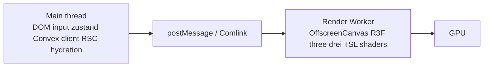

# offscreen-canvas-render

## Decision

Entire 3D rendering moves to a Web Worker via `OffscreenCanvas`. Main thread retains only DOM, input dispatch, and lightweight UI state. R3F + Three.js + drei all support this path.

## Why

- Three.js + R3F render loop on main thread blocks input dispatch during heavy frames
- Mid-tier laptops + mobile read-only renders genuinely benefit from main-thread freedom
- Locked perf budgets (INP ≤ 16ms desktop, 60fps floor) easier to defend with rendering off main thread
- Substrate boundary: `packages/three-kit` exposes a worker-friendly mount that knows nothing about MIPS / K-map

## Architecture



## Communication

Comlink-typed RPC over `postMessage`:

```ts
// main
const renderApi = wrap<RenderWorkerApi>(new Worker('/render.worker.js'));
await renderApi.mount(offscreenCanvas);
await renderApi.setState(simState);
await renderApi.dispatchInput({ kind: 'orbit', dx, dy });
```

Sim state diffs sent over postMessage. For high-frequency updates (scrub seek), use `Transferable` `Float32Array` of state-diff bytes.

## Fallback

Browsers without OffscreenCanvas (rare on locked browser matrix — see `BROWSER-SUPPORT.md`): fall back to main-thread R3F. Same React API; mount path differs. `packages/three-kit` exposes both.

## Input handling

Mouse / keyboard input on main thread (DOM). Forwarded to render worker via `dispatchInput` RPC. Worker maintains camera + scene state; emits frames; no main-thread render work.

Pointer raycast for K-map cell picking happens on render worker via drei `Bvh`. Hit result returned to main thread.

## Limitations + workarounds

- DOM-related drei helpers (`Html`, `Hud`) don't work in worker — replaced by `packages/hud` uikit-backed in-3D overlays (already locked)
- Some Three.js features need polyfill in worker (loaders, etc.) — handled by R3F's worker setup
- Stats / debug overlays (leva, r3f-perf) render via main-thread bridge

## Caught by

- Render worker boots smoke
- Frame-rate smoke: 3D scene runs at locked framerate during heavy main-thread compute (assembler running, etc.)
- INP smoke: input latency ≤ 16ms during 3D animation
- Fallback smoke: main-thread render works when OffscreenCanvas mocked unavailable
