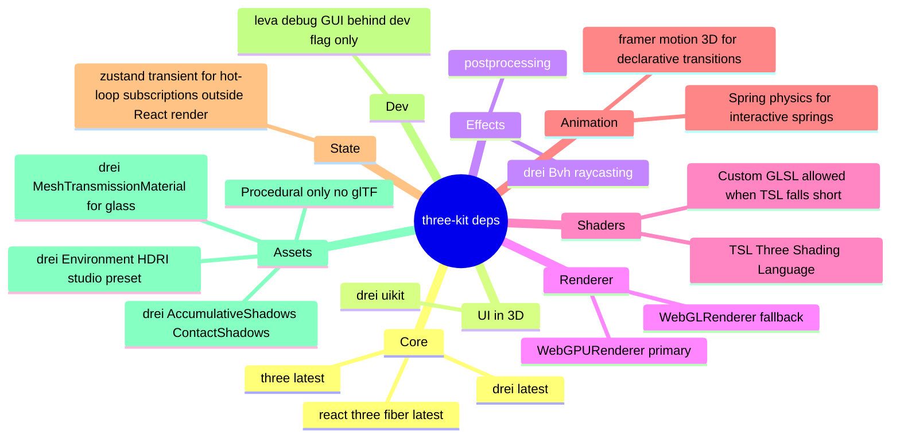

# three-stack

## Decision

## Rejected alternatives

- **Babylon.js** — heavier API, less React-native, worse pmndrs ecosystem coverage.
- **PlayCanvas** — closed editor pipeline, less code-first.
- **TresJS / Threlte** — Vue / Svelte ecosystems; off-stack vs React.
- **Hand-rolled WebGL** — reinventing three.js; `book/PHILOSOPHY.md` OSS-import-first violation.
- **glTF-authored assets** — requires authoring tool outside agent loop per `adr/asset-authoring.md`.

## WebGPU primary + WebGL fallback

`<Canvas frameloop="demand" gl={async (props) => { const r = new WebGPURenderer(props); await r.init(); return r; }}>` with detection — falls back to drei default WebGL renderer when WebGPU unavailable. TSL shaders portable across both via three's node-material auto-compile.

## three-kit exports

| Export | Concern |
|---|---|
| `Materials.MachinedAluminum` | Brushed PBR with normal + roughness maps procedural |
| `Materials.Silicon` | Anisotropic die surface |
| `Materials.PCB` | FR4-colored substrate with micro-detail |
| `Materials.EmissiveTrace` | Bus material, intensity-tunable, signal-pulse compatible |
| `Materials.Glass` | Transmission material with low chromatic ab |
| `Shaders.signalPulse(curve, speed, intensity)` | Light traveling along a curve, time-driven |
| `Shaders.scanline(intensity)` | Scanline overlay for retro tone (optional) |
| `Camera.Bookmarks` | Hook + helpers for bookmarked view dolly |
| `Lighting.StudioRig` | Key light + HDRI + contact shadows preset |
| `Postprocessing.IndustrialChain` | SMAA + restrained bloom + SSAO + vignette + chromatic-ab preset |
| `Instancing.useInstanced(<n>)` | Helper for >1k instanced primitives |

## Caught by

- `tools/lint/stack-presence.ts` greps `packages/three-kit/package.json` for each named dep + at least one consumer site in src.
- Renderer detection unit-test: WebGPU mock yields WebGPU path, no-WebGPU mock yields WebGL path.
