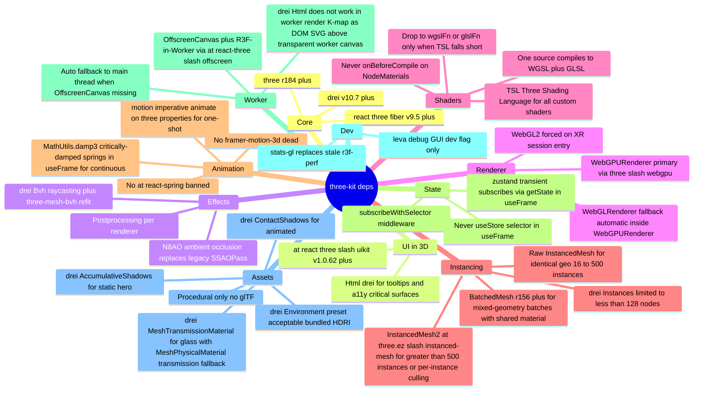

# three-stack

## Decision



## Rejected alternatives

- **Babylon.js** — heavier API, less React-native, worse pmndrs ecosystem coverage.
- **PlayCanvas** — closed editor pipeline, less code-first.
- **TresJS / Threlte** — Vue / Svelte ecosystems; off-stack vs React.
- **Hand-rolled WebGL** — reinventing three.js; `book/PHILOSOPHY.md` OSS-import-first violation.
- **glTF-authored assets** — requires authoring tool outside agent loop per `adr/asset-authoring.md`.
- **framer-motion-3d** — abandoned by motion team; succeeded by `motion`'s imperative `animate()` for 3D properties.
- **`@react-spring/*`** — banned per pm4ai animation policy.

## WebGPU primary + WebGL2 fallback

R3F v9 async `gl` factory:

```tsx
<Canvas
  frameloop="demand"
  gl={async (props) => {
    if (xrRequested) return new WebGLRenderer(props);  // WebGPU+WebXR not supported in 2026
    const r = new WebGPURenderer({ ...props, forceWebGL: false });
    await r.init();
    return r;
  }}
>
```

`WebGPURenderer` auto-falls-back to WebGL2 internally when `navigator.gpu` is missing or adapter request fails. Dual-path testing via `new WebGPURenderer({ forceWebGL: true })` under env flag — CI runs both paths.

Compute shaders + storage buffers + multiple render targets >8 unavailable in WebGL2 fallback — gate heavy compute via `backend === 'webgpu'` detection.

## Instancing decision tree

| Instance count | Picker | Notes |
|---|---|---|
| ≤16 identical | Plain `<mesh>` per instance | No reconciler cost worth optimizing |
| 16–500 identical, dynamic colors | Raw `<instancedMesh>` + `setMatrixAt` + `instanceColor` | drei `<Instances>` reconciler overhead measurable at scale |
| >500 identical, need per-instance culling | `@three.ez/instanced-mesh` (InstancedMesh2) | CPU+BVH culling, LOD, sorting, skinning built-in |
| Mixed geometries, shared material | `BatchedMesh` r156+ | 1 draw call across different geometries; retains per-instance pickability via `getInstanceIdAt` |
| Truly static substrate | `BufferGeometryUtils.mergeGeometries(..., useGroups=true)` | Single mesh, single vertex buffer; loses per-component picking |

`drei.<Instances>` reconciler overhead is measurable above ~128 nodes per pmndrs issues #1154 / #3306. Skip for K-map dynamic recoloring; use raw `instancedMesh` with `instanceColor`.

## three-kit exports

| Export | Concern |
|---|---|
| `Materials.MachinedAluminum` | `MeshPhysicalNodeMaterial` with native `anisotropy` (KHR_materials_anisotropy), procedural brushed-noise roughness via TSL `mx_noise_float`, clearcoat 0.25 |
| `Materials.Silicon` | Anisotropic die surface |
| `Materials.PCB` | FR4-shaped via `mx_worley_noise`, satin sheen, SDF-style emissive trace lines with `fwidth` antialias |
| `Materials.EmissiveTrace` | Tube material with per-vertex `aT` arc-length attribute, uniform-driven head + tail pulse |
| `Materials.Glass` | drei `MeshTransmissionMaterial` (samples 6–10) — with `MeshPhysicalMaterial.transmission` fallback for WebGPU edge cases + low-tier devices |
| `Shaders.signalPulse(curve, speed, intensity)` | Time-driven TSL node, peak at 30%, exponential head + linear tail, arc-length parameterized via `getSpacedPoints` |
| `Camera.Bookmarks` | Hook + helpers wrapping drei `CameraControls` with `setLookAt` transitions + critically-damped FOV interpolation |
| `Lighting.StudioRig` | drei `Environment preset="studio"` + 3-point directional (key warm, fill cool, rim white) + `AccumulativeShadows` static / `ContactShadows` animated |
| `Postprocessing.IndustrialChain` | N8AO + SMAA last + bloom restrained (`luminanceThreshold: 1.0` gating, `mipmapBlur`, intensity 0.35) + chromatic ab + vignette + AGX tonemap — per renderer (WebGL2 uses `postprocessing` v6, WebGPU uses three's native TSL `PostProcessing`) |
| `Instancing.useInstanced(<n>)` | Decision-tree wrapper picking `instancedMesh` / `InstancedMesh2` / `BatchedMesh` based on count + heterogeneity |
| `Renderer.create()` | Async factory returning `WebGPURenderer` or `WebGLRenderer` (XR session) with `outputColorSpace` baked |

## Postprocessing per renderer

WebGPU primary + `postprocessing` v6 is contradictory — v6 is WebGL2-only. Per-renderer chain:

| Renderer | Pipeline |
|---|---|
| `WebGPURenderer` | three's native TSL `PostProcessing` (`three/addons/postprocessing/PostProcessing.js`) — bloom, chromatic ab, AGX tonemap available as TSL nodes |
| `WebGLRenderer` (fallback or XR) | `postprocessing` v6 (pmndrs/vanruesc) — N8AO + EffectPass with bloom + chromatic ab + vignette + SMAA |

`packages/three-kit/post/` exports both pipelines under a single `IndustrialChain` API that dispatches per renderer.

## XR substrate constraint

WebGPU + WebXR is NOT supported in 2026 (three.js #28968, #30806). On `navigator.xr.requestSession` the renderer must already be `WebGLRenderer` — renderer swap mid-session is not feasible.

Substrate `Renderer.create({ xrRequested })` returns `WebGLRenderer` when XR session is requested. App must decide at mount, not at session-enter.

## Caught by

- `tools/lint/stack-presence.ts` greps `packages/three-kit/package.json` for each named dep + at least one consumer site in src
- Renderer detection unit-test: WebGPU mock yields WebGPU path, no-WebGPU mock yields WebGL path, XR-requested mock yields WebGL path
- Instancing decision-tree test: synthetic counts trigger correct picker
- AOT compile smoke: `compileAsync` settle before first interaction
- Post chain test per renderer: same scene produces equivalent output under WebGL2 + WebGPU paths within tolerance
